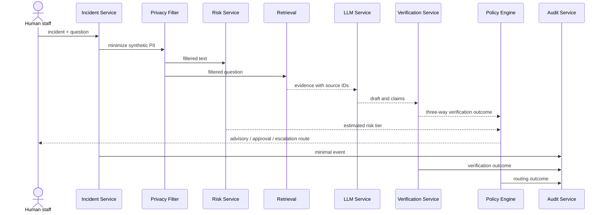

# AI pipeline

Failure at retrieval yields insufficient evidence; provider failure is
contained; unsupported or contradicted claims require review. These are
prototype contracts, not a production availability guarantee.
