# Component view

| Component | Input / output | Trust boundary and failure behavior |
|---|---|---|
| API Gateway | Validated request / response | Not implemented as a network server; future authentication boundary |
| Incident Service | Incident records | Domain data marked synthetic in this study |
| ML Risk Service | Text / risk label and metrics | Sparse baseline; class-sensitive error evaluation |
| Transformer Risk Service | Text / risk label | Optional local model; no remote code execution; explicit download opt-in |
| Retrieval Service | Question / evidence IDs, scores, sources | Empty results remain empty; does not fabricate evidence |
| LLM Service | Bounded prompt / provider output | `LLMProvider`; errors become `LLM_FAILURE` |
| Verification Service | Claims + evidence / three-way label | Heuristic is fallible; unknown or contradiction routes to review |
| Policy Engine | Risk tier / route | High approval, critical escalation, no automatic execution |
| Privacy Filter | Text / redacted text | Synthetic email/phone patterns only; false positives and misses possible |
| Human Approval Gateway | Proposed recommendation / approval route | Policy outcome signals approval; human identity/workflow not implemented |
| Audit Service | Minimal structured event | No raw incident text; append-only JSONL prototype |
| Decision Store | Decision ID / copied record | In-memory prototype; not durable |

Mermaid detail:

```mermaid
flowchart TB
  Input[Incident + question] --> P[Privacy filter]
  P --> C[TF-IDF classifier]
  P --> R[Lexical evidence retriever]
  R --> Prompt[Context with evidence IDs]
  Prompt --> Provider[LLMProvider]
  Provider --> Claims[Claim extraction]
  Claims --> Check[SUPPORTED / CONTRADICTED / UNKNOWN]
  C --> Policy[Risk policy]
  Check --> Policy
  Policy -->|LOW/MEDIUM advisory| Staff[Human staff]
  Policy -->|HIGH approval| Approval[Approval gateway]
  Policy -->|CRITICAL escalation| Approval
```

