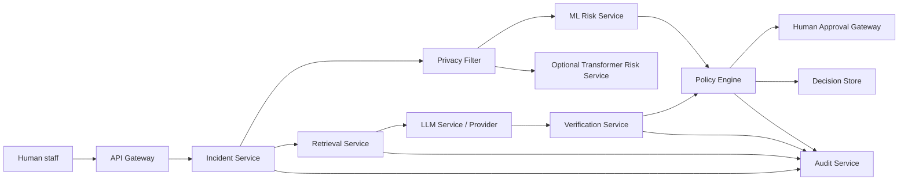

# Container view

The containers are responsibility boundaries, not independently deployed
processes in this prototype. `src/trustworthy_llm/` supplies in-process
components and contract boundaries; network/API, authentication, durable
storage, and access control remain future work.
