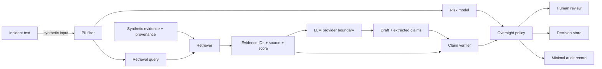

# Data flow

Raw prompt text is not included in the audit event schema. Any implementation
that persists prompts or evidence must define purpose, retention, access, and
redaction controls before use.
