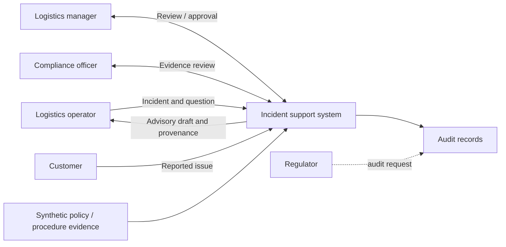

# System context

The system supports human triage and drafting. It does not make autonomous
logistics decisions or execute transport, release, or customer-account actions.
External evidence sources and stakeholders are trust boundaries.
