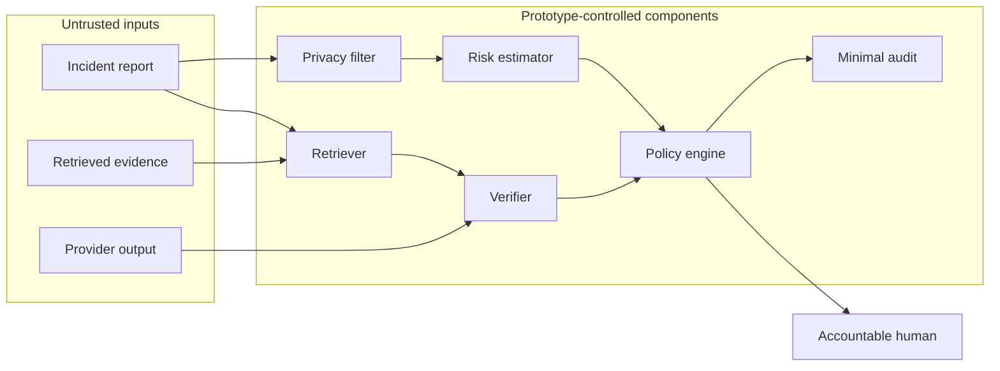

# Trust boundaries

Incident and evidence text are untrusted data, not instructions. Provider
outputs are untrusted claims. The local prototype has no authentication,
authorization, tenant isolation, network egress policy, or secret management.
Do not expose it as a service until those controls and a threat model exist.
